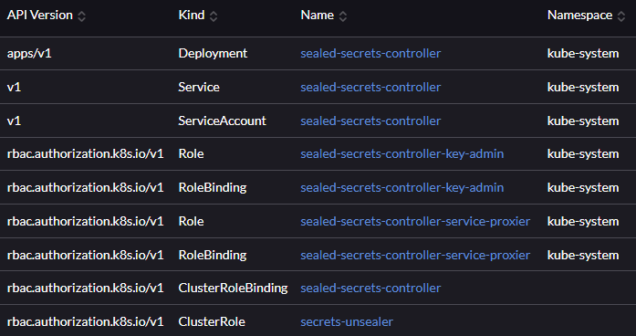

# Sealed Secrets

This Helm chart will install [Sealed Secrets](https://sealed-secrets.netlify.app/) ([GitHub](https://github.com/bitnami-labs/sealed-secrets), [helm](https://github.com/bitnami-labs/sealed-secrets/tree/main/helm/sealed-secrets)).

💡 Kubernetes objects will be installed in `kube-system` namespace

## How to update the chart

```bash
# (only once) adds ingress-nginx helm chart repository
helm repo add sealed-secrets https://bitnami-labs.github.io/sealed-secrets

# updates repository information
helm repo update

# lists available charts and get latest version of the chart
helm search repo sealed

# (if needed) updates Chart.yaml with version

# updates Chart.lock (and downloads locally the charts)
helm dependency update

# checks the Kubernetes objects generated from the chart
helm template . -f values.yaml --namespace kube-system > temp.yaml
```

## How to deploy manually

⚠ Helm release name must be "sealed-secrets-controller" in order for kubeseal to work by default (or use `kubeseal --controller-name sealed-secrets <args>`)

```bash
# installs the chart with helm
helm upgrade --install -f values.yaml --create-namespace \
  -n kube-system sealed-secrets-controller .

# checks all resources are created correctly
kubectl get services -o wide sealed-secrets-controller --namespace kube-system
kubectl get deploy sealed-secrets-controller -n kube-system

# if needed, deletes the chart
helm delete sealed-secrets-controller -n kube-system
```

## How to encrypt a data to put in git

* Install `kubeseal` (example for Linux, on Windows download the latest version and move it to a folder present in PATH)

```bash
# look at the latest version in https://github.com/bitnami-labs/sealed-secrets/releases
wget -c https://github.com/bitnami-labs/sealed-secrets/releases/download/v0.19.1/kubeseal-0.19.1-linux-amd64.tar.gz -O - | tar -xz
sudo install -m 755 kubeseal /usr/local/bin/kubeseal
rm kubeseal
```

* Encrypt secrets in a file (you should be connected to the Kubernetes cluster)

```bash
kubectl create secret xxx --namespace=yyy --dry-run=client -o yaml | kubeseal -o yaml > manifests/argocd-sealedsecret.yaml

# example
kubectl create secret generic wordpress-credentials \
  --from-literal=wordpress-password='xxxxx' \
  --namespace=fleet-sample --dry-run=client -o yaml | kubeseal -o yaml > secrets.yaml
```

## How to troubleshoot

### Chart resource list


